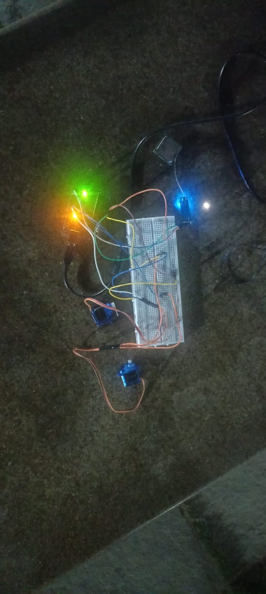
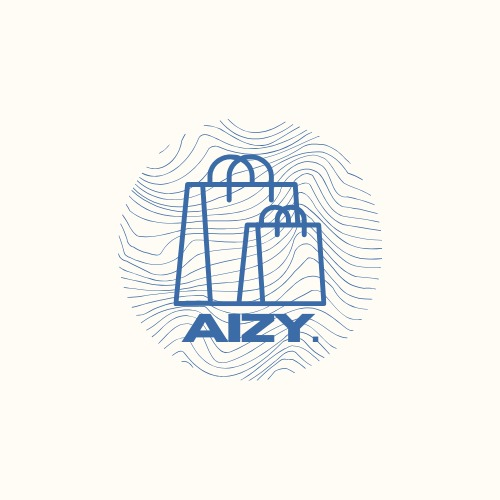
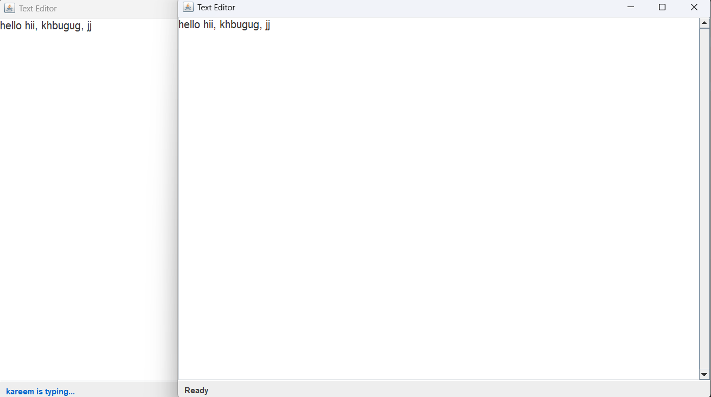

# Shaik Kareem

 

   

> I build intelligent features (LLMs, RAG, analytics) and ship full‑stack apps with clean APIs, auth, and solid DX.

Highlights: 10+ Projects • 3 Hackathons/Finals • Strong DSA in Java

> 🧭 Focus: AI/ML + Full‑Stack • Product-minded • Performance & realtime
>
> 💼 Open to: AI/ML Engineer, Full‑Stack Developer, SWE Internships

## 🚀 Featured Projects

### Hand Gestures Controller

Hands‑free control using OpenCV + MediaPipe; translates gestures to real‑time mouse/keyboard events (PyAutoGUI).

Stack: Python · OpenCV · MediaPipe · PyAutoGUI • [Repository →](https://github.com/kareem1207/Hand-gestures)

### Space Debris Tracker

Computes orbits from TLE with Skyfield; hardware prototype (Arduino Nano, GPS, Servos) for tracking.

Stack: Python · Skyfield · TLE · Hardware • [Repository →](https://github.com/kareem1207/Space-Debris-Tracker)

### Aizy — Full‑Stack AI Platform

Next.js app + Express backend + FastAPI microservice; hybrid MongoDB/MySQL via Prisma; JWT auth.

Stack: Next.js · Express · FastAPI · MongoDB · MySQL · Prisma · Tailwind • [Repository →](https://github.com/kareem1207/Aizy)

### Collaborative Text Editor

Real‑time editor over a custom TCP protocol; Java NIO + Swing; multithreaded client‑server.

Stack: Java · Sockets · NIO · Swing · Maven • [Repository →](https://github.com/kareem1207/CollabEditor)

More noteworthy: [3D Portfolio Generator](https://github.com/kareem1207/3d-Portfolio-Generator) • [SehatSaathi 2.0](https://github.com/kareem1207/SehatSaathi-2.0)

---

## 🧠 Skills

### Core Stack

            

### Extras

OpenCV • MediaPipe • Skyfield • Scikit‑learn • Pandas • NumPy • Matplotlib • Seaborn • RAG • LLM Integration • JWT • REST APIs

<!-- Icons grid removed to keep lint clean and layout crisp; badges above cover the stack -->

### Developer Tools

        

---

## 🎓 Certifications

- Python — HackerRank • [Certificate](https://www.hackerrank.com/certificates/a2e14641612f)
- Java — HackerRank • [Certificate](https://www.hackerrank.com/certificates/e92107aec059)
- JavaScript — HackerRank • [Certificate](https://www.hackerrank.com/certificates/e15be6c2e27e)
- JavaScript (Intermediate) — HackerRank • [Certificate](https://www.hackerrank.com/certificates/e662d777b886)

---

## 📊 GitHub Stats

---

## 🏆 Trophies

---

## 🐍 Contributions

---

## 📦 Top Repositories

| Repo | Repo |
|---|---|
|  |  |
|  |  |

## 🤝 Connect

- LinkedIn: [Profile](https://www.linkedin.com/in/kareem-shaik-4a0797379/)
- Portfolio: [kareem1207.github.io/portfolio](https://kareem1207.github.io/portfolio/)
- GitHub: [github.com/kareem1207](https://github.com/kareem1207)
- LeetCode: [leetcode.com/kareem1207](https://leetcode.com/kareem1207/)
- Email: [kareemshaik1207@gmail.com](mailto:kareemshaik1207@gmail.com)

© 2025 Shaik Kareem
