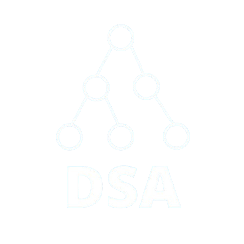
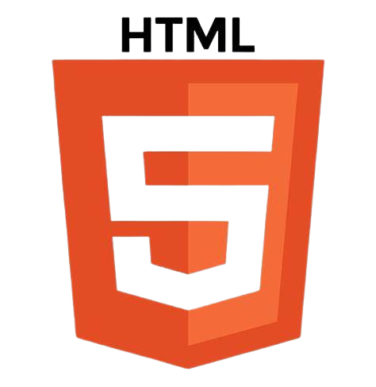
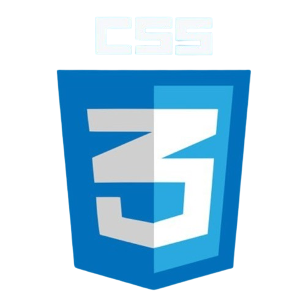
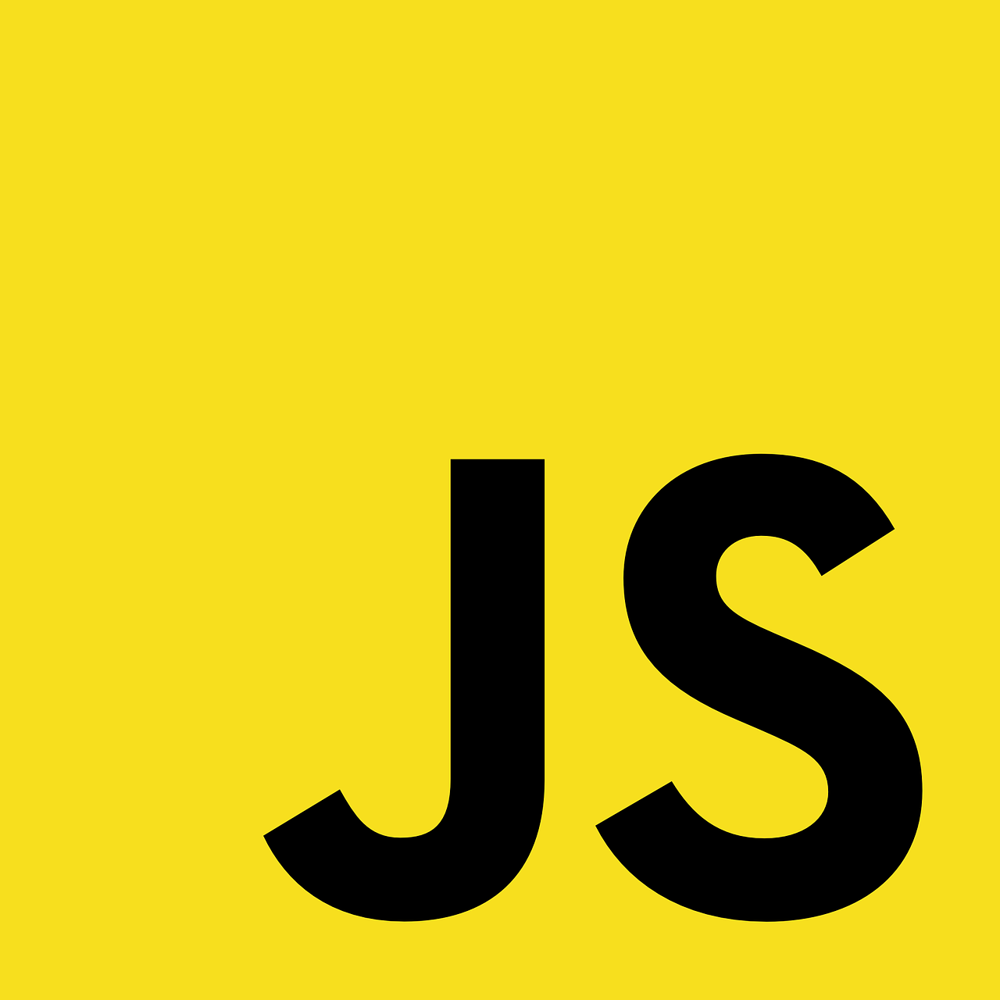
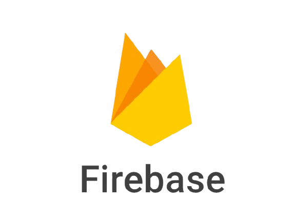
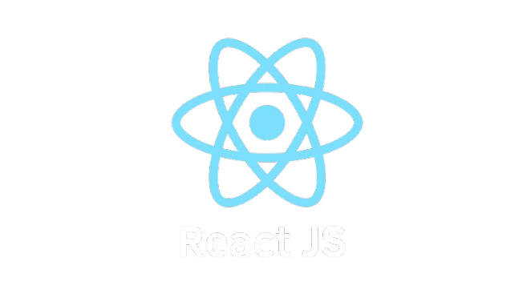

- 👋 Hi, I’m @kareem1207
- 👀 I’m interested in ... coding
- 🌱 I’m currently learning ... dsa using java
- 💞️ I’m looking to collaborate on ... any project
- 📫 How to reach me ... for now you can reach me through insta
- 🗣️ Languages I speak : English , Hindi , Telugu
- ⚡ Fun fact: ... the fun fact about me is i am a srk fan
- 💻 Programming Languages:... I know following programming languages :

  
  
  
  
  
  
  
  
  
  
  

<!---
kareem1207/kareem1207 is a ✨ special ✨ repository because its `README.md` (this file) appears on your GitHub profile.
You can click the Preview link to take a look at your changes.
--->
