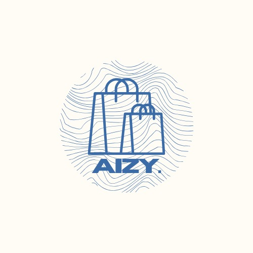
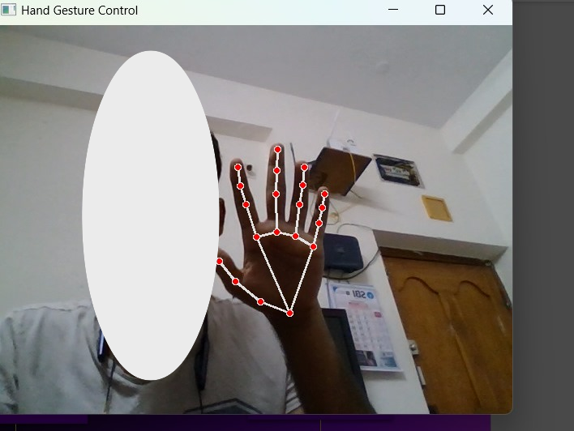
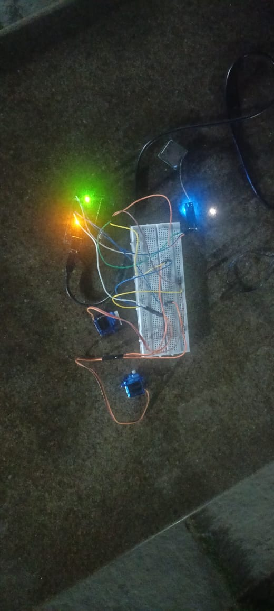

# Shaik Kareem

 

   

> I build systems that think, and the interfaces worth thinking in — LLM orchestration, RAG, multi-agent pipelines, and the full-stack scaffolding that makes them usable.

Highlights: 10+ Projects • 3 Hackathon Finals • CGPA 8.72 • Strong DSA in Java

> 🧭 Focus: AI systems + Full-Stack • Data pipelines under load • Performance & realtime
>
> 💼 Open to: AI/ML Engineer, Full-Stack Developer, SWE Internships

---

## 🚀 Featured Projects

### Aura — AI-Powered Agentic Web Browser & Productivity Suite

A desktop browser that can be told what to do instead of clicked through. Multi-tab navigation, isolated profile partitions (Spaces), collapsible tab groups, split-view layouts and stateful session recovery — plus an autonomous automation pipeline built on a unified `ModelRouter` for local/remote LLMs and a `TaskExecutionEngine` (Planner → ActionResolver → Verifier). Ships with an in-app office suite for documents, spreadsheets and PDFs, accelerated by a custom Rust-to-WebAssembly file engine and Tesseract.js OCR.

Stack: Electron · React · Node.js · Go · Rust · WebAssembly · Gemini · Claude · OpenAI · Ollama

🔒 Closed source — Aura is my own browser and stays confidential. Happy to walk through the architecture.

### GridSense AI — Predictive Grid Fault Intelligence

Power infrastructure fails loudly and late. GridSense ingests thousands of live meter feeds over MQTT, predicts transformer failures 48–72 hours ahead, and hands field engineers a plain-language work order instead of a dashboard to decode. Fault-tolerant telemetry pipeline in Java/Spring Boot + Kafka across 5,000+ smart meters and 100 transformer units; dual-model analytics using TensorFlow LSTM autoencoders and scikit-learn Isolation Forest; LangChain diagnostic agent doing RAG over a vector database.

Stack: Java · Spring Boot · Apache Kafka · MQTT · TimescaleDB · TensorFlow · LangChain · FastAPI · Python • [Repository →](https://github.com/kareem1207/GridSense-AI)

### Aizy — Full-Stack Platform with AI Analytics

AI-driven e-commerce platform with three separate domains for customers, sellers and admins. Next.js front end, Express.js + FastAPI services, hybrid MongoDB/MySQL architecture via Prisma ORM and Mongoose, with Random Forest and ARIMA models for recommendation and trend forecasting.

Stack: Next.js · Express · FastAPI · MongoDB · MySQL · Prisma · Tailwind · JWT • [Repository →](https://github.com/kareem1207/Aizy)

---

## 🧩 Also Built

### Foreknow — AI Cognitive Assessment Platform

Full-stack platform for early dementia screening: memory, Stroop, image recall and speech tests, scored by a CrewAI pipeline orchestrating Gemini 2.0 Flash, Whisper and Hugging Face models into diagnostic reports and PDF exports.

Stack: Next.js · FastAPI · CrewAI · Gemini · Whisper • [Repository →](https://github.com/kareem1207/Forkenow)

### Hand Gestures Controller

Hands-free control using OpenCV + MediaPipe; translates gestures to real-time mouse/keyboard events. 🥉 3rd place at the MGIT Project Expo.

Stack: Python · OpenCV · MediaPipe · PyAutoGUI • [Repository →](https://github.com/kareem1207/Hand-gestures)

### Collaborative Text Editor

Real-time multi-user editor over a custom TCP protocol; Java NIO + Swing, multithreaded client-server. No frameworks, just the network stack.

Stack: Java · Sockets · NIO · Swing · Maven • [Repository →](https://github.com/kareem1207/CollabEditor)

### Space Debris Tracker

Computes orbits from TLE data with Skyfield; hardware prototype (Arduino Nano, GPS, servos) for physical tracking.

Stack: Python · Skyfield · TLE · Hardware • [Repository →](https://github.com/kareem1207/Space-Debris-Tracker)

More: [SehatSaathi 2.0](https://github.com/kareem1207/SehatSaathi-2.0) • [3D Portfolio Generator](https://github.com/kareem1207/3d-Portfolio-Generator) • [DeepSeek for VS Code](https://github.com/kareem1207/deepseek)

---

## 🧠 Skills

### Languages

      

### AI / ML

      

CrewAI (Multi-Agent) • RAG • Prompt Engineering • LLM Integration • Whisper • Vector Databases • Predictive Analytics • EDA • Matplotlib • Seaborn

### Frontend

     

React Query • React Router

### Backend & APIs

     

REST API Design • JWT Authentication

### Databases & ORMs

   

TimescaleDB • Vector Databases • Mongoose

### Analytics & BI

AI Analytics • Analytical Reporting • Data Quality Management

### Developer Tools

       

---

## 🏆 Achievements

- **Finalist — Telangana CodeUnnati Hackathon** (Edunet Foundation, Feb–Mar 2025) — built SehatSaathi 2.0, an AI health assistant pairing symptom analysis with a structured medical knowledge base for rural healthcare access. [Repo](https://github.com/kareem1207/SehatSaathi-2.0) • [Demo](https://sehatsaathi2.vercel.app/)
- **3rd Place — Project Expo, MGIT** (Nov 2024) — gesture-based computer controller using OpenCV, MediaPipe and PyAutoGUI. [Repo](https://github.com/kareem1207/Hand-gestures)
- **Shortlisted — Smart India Hackathon, Internal Round** (Sep 2024) — SehatSaathi, an AI-powered healthcare chatbot. [Repo](https://github.com/AgentElemental/SehatSaathi) • [Demo](https://sehatsaathi.netlify.app)
- **Tata Group Data Analytics Job Simulation** — Forage / Tata iQ (Oct 2025) — GenAI-driven EDA, a no-code predictive modelling framework, and an AI collections strategy covering agentic automation and ethical AI.

---

## 🎓 Education

| Institution | Qualification | Score | Period |
|---|---|---|---|
| Mahatma Gandhi Institute of Technology, Hyderabad | B.Tech, Computer Science & Engineering (AI & ML) | **CGPA 8.72** | Sep 2023 – Present |
| KMR Junior College, Hyderabad | Intermediate, MPC | **95.2%** | Jul 2021 – Mar 2023 |

---

## 📜 Certifications

- Python — HackerRank • [Certificate](https://www.hackerrank.com/certificates/a2e14641612f)
- Java — HackerRank • [Certificate](https://www.hackerrank.com/certificates/e92107aec059)
- JavaScript — HackerRank • [Certificate](https://www.hackerrank.com/certificates/e15be6c2e27e)
- JavaScript (Intermediate) — HackerRank • [Certificate](https://www.hackerrank.com/certificates/e662d777b886)

---

## 📊 GitHub Stats

---

## 🏅 Trophies

---

## 🐍 Contributions

---

## 📦 Top Repositories

| Repo | Repo |
|---|---|
|  |  |
|  |  |

---

## 🤝 Connect

- LinkedIn: [Profile](https://www.linkedin.com/in/kareem-shaik-4a0797379/)
- Portfolio: [kareem1207.github.io/portfolio](https://kareem1207.github.io/portfolio/)
- GitHub: [github.com/kareem1207](https://github.com/kareem1207)
- LeetCode: [leetcode.com/kareem1207](https://leetcode.com/kareem1207/)
- Email: [kareemshaik1207@gmail.com](mailto:kareemshaik1207@gmail.com)

© 2025 Shaik Kareem
