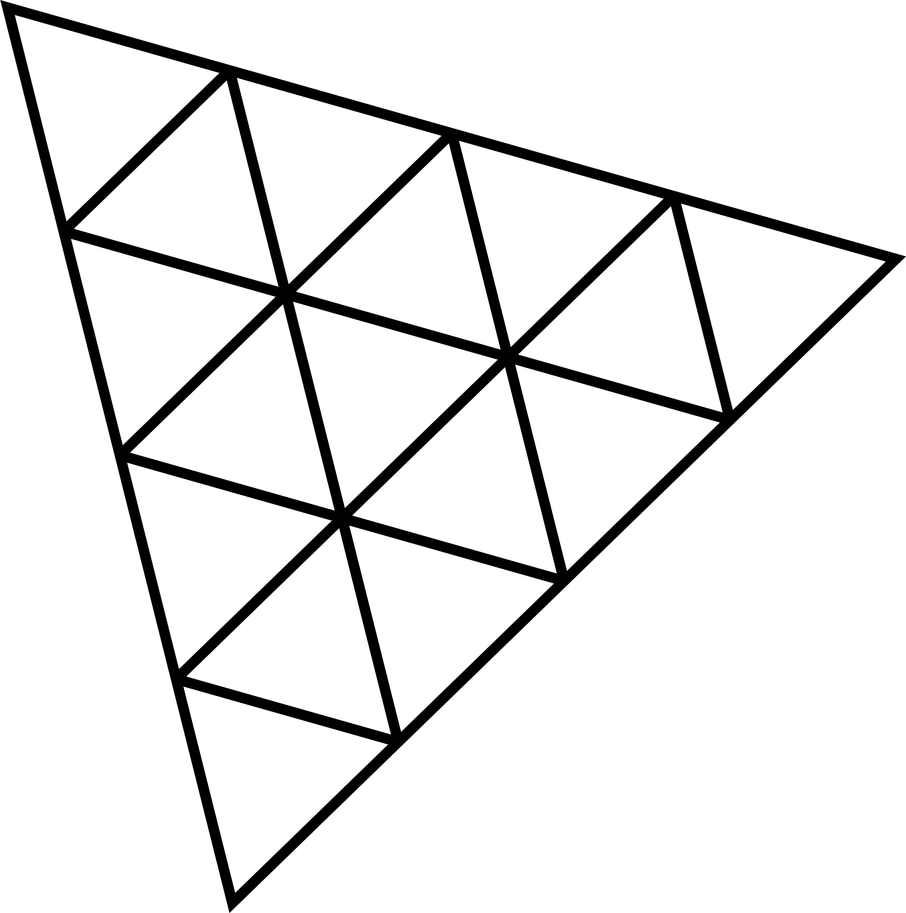

Hello! I'm Shaik Kareem, a passionate developer with knowledge of various programming languages.

## Projects

### Hand Gestures Code

This project involves recognizing hand gestures using computer vision techniques. It showcases your skills in image processing and machine learning.

### Web Chat Application

<picture>
  <source media="(prefers-color-scheme: dark)" srcset="./images/Projects/web-chat.png">
  <source media="(prefers-color-scheme: light)" srcset="./images/Projects/web-chat-light.png">
  
</picture>

This project is a real-time web chat application built with modern web technologies. It demonstrates your proficiency in web development and real-time communication.

## Contact

- **Email:** kareemshaik1207@gmail.com
- **GitHub:** [My Github Account](https://github.com/kareem1207)
- **Daily Dev:** [My daily.dev Account](https://app.daily.dev/kareemshaik)
- **Instagram:** [My Instagram Account](https://www.instagram.com/kareem_shaik1207/)

## Github Stats

<picture>
  <source media="(prefers-color-scheme: dark)" srcset="https://github-readme-stats.vercel.app/api?username=kareem1207&theme=midnight-purple&show_icons=true&hide_border=true&include_all_commits=true#gh-dark-mode-only">
  <source media="(prefers-color-scheme: light)" srcset="https://github-readme-stats.vercel.app/api?username=kareem1207&theme=flag-india&show_icons=true&hide_border=true&include_all_commits=true#gh-light-mode-only">
  
</picture>

<picture>
  <source media="(prefers-color-scheme: dark)" srcset="https://github-readme-stats.vercel.app/api/top-langs/?username=kareem1207&theme=outrun&layout=donut&size_weight=0.5&count_weight=0.5&langs_count=20&hide_border=true#gh-dark-mode-only">
  <source media="(prefers-color-scheme: light)" srcset="https://github-readme-stats.vercel.app/api/top-langs/?username=kareem1207&theme=swift&layout=donut&size_weight=0.5&count_weight=0.5&langs_count=20&hide_border=true#gh-light-mode-only">
  
</picture>

## Github Top Repos

  <a href ="https://github.com/kareem1207/Hand-gestures" >
<picture>
  <source media="(prefers-color-scheme: dark)" srcset="https://github-readme-stats.vercel.app/api/pin/?username=kareem1207&theme=blue-green&repo=Hand-gestures&hide_border=true">
  <source media="(prefers-color-scheme: light)" srcset="https://github-readme-stats.vercel.app/api/pin/?username=kareem1207&theme=ambient_gradient&repo=Hand-gestures&hide_border=false">
  
</picture>
  </a>
  <a href ="https://github.com/kareem1207/Connecto" >
<picture>
  <source media="(prefers-color-scheme: dark)" srcset="https://github-readme-stats.vercel.app/api/pin/?username=kareem1207&theme=great-gatsby&repo=Connecto&hide_border=true">
  <source media="(prefers-color-scheme: light)" srcset="https://github-readme-stats.vercel.app/api/pin/?username=kareem1207&theme=buefy&repo=Connecto&hide_border=false">
  
</picture>
  </a>
  <a href ="https://github.com/kareem1207/img2pdf" >
<picture>
  <source media="(prefers-color-scheme: dark)" srcset="https://github-readme-stats.vercel.app/api/pin/?username=kareem1207&theme=highcontrast&repo=img2pdf&hide_border=true">
  <source media="(prefers-color-scheme: light)" srcset="https://github-readme-stats.vercel.app/api/pin/?username=kareem1207&theme=moltack&repo=img2pdf&hide_border=false">
  
</picture>
</a>
  <a href ="https://github.com/kareem1207/Bank-Algorithm-in-java" >
<picture>
  <source media="(prefers-color-scheme: dark)" srcset="https://github-readme-stats.vercel.app/api/pin/?username=kareem1207&theme=codeSTACKr&repo=Bank-Algorithm-in-java&hide_border=true">
  <source media="(prefers-color-scheme: light)" srcset="https://github-readme-stats.vercel.app/api/pin/?username=kareem1207&theme=graywhite&repo=Bank-Algorithm-in-java&hide_border=false">
  
</picture>
  </a>

## Skills

### Programming Languages

### Algorithms

<picture>
  <source media="(prefers-color-scheme: dark)" srcset="./images/Algorithms/dsa.png">
  <source media="(prefers-color-scheme: light)" srcset="./images/Algorithms/dsa-light.png">
  
</picture>

### Databases

### Frameworks

## Achievements

- **Achievement One:** Acquired 3rd rank in Project Expo conducted by MGIT.
- **Achievement Two:** Won a Coding Quiz Competition.

## Blog

Check out my latest blog posts on [Your Blog](https://yourblog.com):

- [Blog Post One](https://yourblog.com/blog-post-one)
- [Blog Post Two](https://yourblog.com/blog-post-two)

## Hobbies

- **Hobby One:** Coding is my 1st hobby.
- **Hobby Two:** Watching SRK movies.
- **Hobby Three:** Getting daily updates on present technologies and coding innovations.
